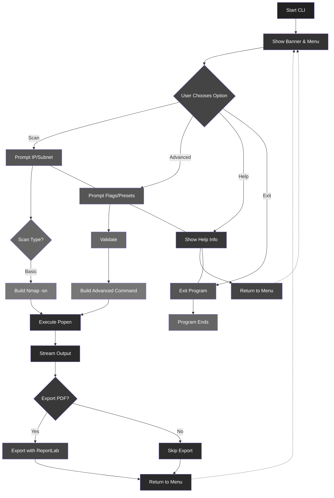
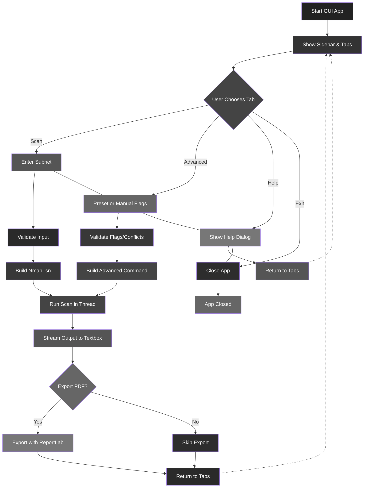

# JaalBreak Scanner

A simple network and port scanner built with Python and CustomTkinter.

---

## Setup

1.  **Clone the repository:**

    ```bash
    git clone https://github.com/shirshxk/JaalBreak
    cd JaalBreak
    ```

2.  **Install dependencies:**

    ```bash
    pip install -r requirements.txt
    ```

3.  **Run the app:**

    ```bash
    python main.py
    ```

    **Note:** Make sure you have **nmap** installed and added to your system PATH for the scanner to function correctly.

---

## Runtime Architecture

### CLI



### GUI

