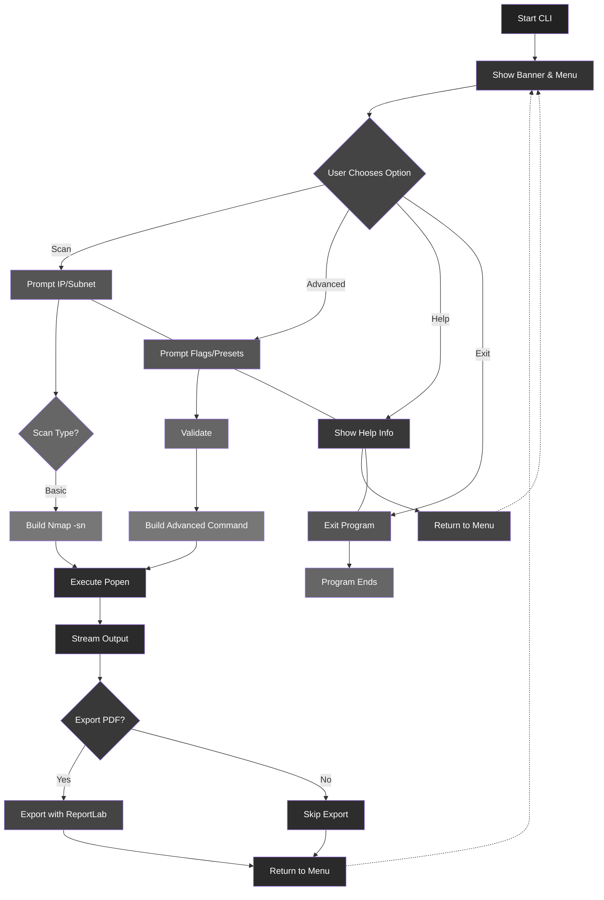

# JaalBreak Scanner

JaalBreak is a Python-based network scanning tool featuring both a command-line interface (CLI) and a graphical user interface (GUI) using CustomTkinter. It is built on top of Nmap and designed for penetration testers, network analysts, and students.

## Features

- Dual Interface: CLI and GUI
- Preset-based scanning (Stealth, Aggressive, OS Detection, etc.)
- Subnet and individual IP scanning
- Real-time output from subprocess
- Threaded GUI execution to prevent freezing
- Export scan results as PDF using ReportLab
- Clean, styled GUI with CustomTkinter
- Input validation and conflict handling

## CLI Preview

```
$ python3 maincli.py

    _____                      __  _______                                 __       
   /     |                    /  |/       \                               /  |      
   $$$$$ |  ______    ______  $$ |$$$$$$$  |  ______    ______    ______  $$ |   __ 
      $$ | /      \  /      \ $$ |$$ |__$$ | /      \  /      \  /      \ $$ |  /  |
 __   $$ | $$$$$$  | $$$$$$  |$$ |$$    $$< /$$$$$$  |/$$$$$$  | $$$$$$  |$$ |_/$$/ 
/  |  $$ | /    $$ | /    $$ |$$ |$$$$$$$  |$$ |  $$/ $$    $$ | /    $$ |$$   $$<  
$$ \__$$ |/$$$$$$$ |/$$$$$$$ |$$ |$$ |__$$ |$$ |      $$$$$$$$/ /$$$$$$$ |$$$$$$  \ 
$$    $$/ $$    $$ |$$    $$ |$$ |$$    $$/ $$ |      $$       |$$    $$ |$$ | $$  |
 $$$$$$/   $$$$$$$/  $$$$$$$/ $$/ $$$$$$$/  $$/        $$$$$$$/  $$$$$$$/ $$/   $$/ 

Choose an option:
1. Scan
2. Help
3. Exit
```

## GUI Features

- Scan Tab: Basic subnet scan (Nmap -sn)
- Advanced Tab: Checkbox and dropdown flags
- Results Tab: Real-time output + PDF export
- Thread-safe subprocess handling
- Styled layout and input prompts

## Requirements

- Python 3.6+
- Nmap installed and available in PATH

## Setup

1.  **Clone the repository:**

    ```bash
    git clone https://github.com/shirshxk/JaalBreak
    cd JaalBreak
    ```

2.  **Install dependencies:**

    ```bash
    pip install -r requirements.txt
    ```

3.  **Run the app:**

    ```bash
    python main.py
    ```

    **Note:** Make sure you have **nmap** installed and added to your system PATH for the scanner to function correctly.

---

## Runtime Architecture



## Running the Application

### CLI Version

```
python3 maincli.py
```

### GUI Version

```
python3 main.py
```

## File Structure

- `maincli.py`: CLI implementation
- `main.py`: GUI implementation using CustomTkinter
- `README.md`: This file

## Notes

- Works best on Linux or WSL with Nmap configured
- GUI is cross-platform but Nmap must be installed
- PDF export requires write permissions

## LICENSE

This project is licensed for educational and research purposes only, developed under the ST5062CEM Programming and Algorithm 2 module (Softwarica College).

---

## CREDITS

Developed by Shirshak Shrestha for coursework submission, July 2025

Course: Programming & Algorithm 2  
Module Code: ST5062CEM  
Instructor: Suman Shrestha
